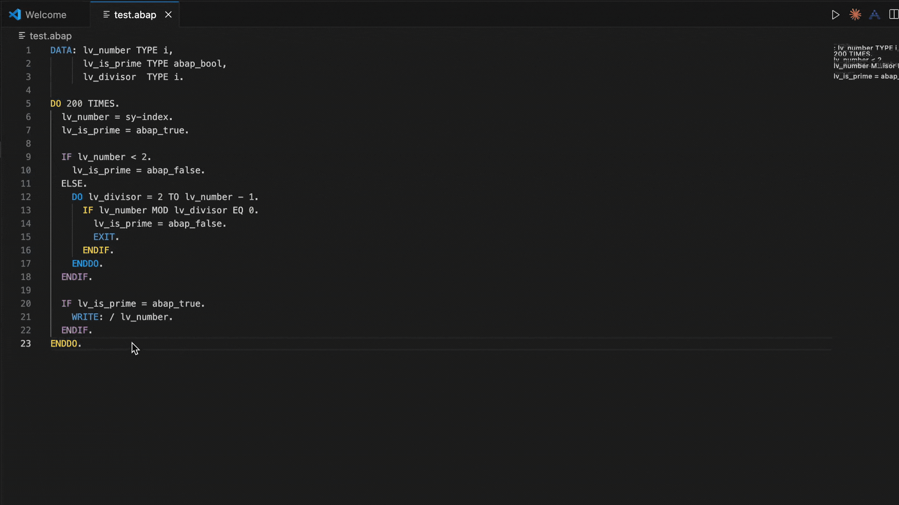

# ABAP AI Code Completion

A VS Code extension that provides AI-powered ABAP code completion and debugging using the Groq API.
## Demo



*Watch the ABAP Code Assistant in action - generating code from comments seamlessly!*
## Features

- **ABAP Code Generation**: Generate ABAP code following SAP best practices
- **ABAP Debug Code Generation**: Generate debugging code with proper ABAP patterns
- **ABAP Syntax Highlighting**: Full ABAP language support with syntax highlighting
- **Groq API Integration**: Uses Groq's fast inference API for code generation
- **SAP Best Practices**: Follows SAP coding standards and guidelines
- **Keyboard Shortcuts**: Quick access with `Ctrl+Shift+G` and `Ctrl+Shift+D`

## Project Structure

```
abap-ai-code-completion/
├── extension/                    # VS Code extension
│   ├── package.json             # Extension manifest
│   ├── extension.js             # Main extension code
│   ├── build.sh                 # Build script
│   ├── README.md                # Extension documentation
│   ├── language-configuration.json  # ABAP language configuration
│   ├── syntaxes/abap.tmLanguage.json  # ABAP syntax highlighting
│   ├── examples/example.abap    # ABAP example file
│   └── python/                  # Python backend
│       ├── main.py              # Extension backend
│       ├── requirements.txt     # Python dependencies
│       └── local_ai_code_completion/  # Core Python package
├── README.md                    # This file
├── .gitignore                   # Git ignore file
└── LICENCE                      # License file
```

## Quick Start

### 1. Install Prerequisites

```bash
# Install Node.js (if not already installed)
# Download from https://nodejs.org/

# Install Python dependencies
cd extension/python
pip install -r requirements.txt
```

### 2. Build the Extension

```bash
cd extension
./build.sh
```

### 3. Install in VS Code

1. Open VS Code
2. Go to Extensions (`Ctrl+Shift+X`)
3. Click "..." in the Extensions panel
4. Select "Install from VSIX..."
5. Choose the generated `.vsix` file

### 4. Setup API Key

1. Open Command Palette (`Ctrl+Shift+P`)
2. Type "ABAP AI: Setup Groq API"
3. Enter your Groq API key

### 5. Use the Extension

1. Open an ABAP file (`.abap`, `.sap`, `.sapabap`)
2. Position cursor where you want code completion
3. Press `Ctrl+Shift+G` for ABAP code generation
4. Press `Ctrl+Shift+D` for ABAP debug code generation

## Development

### Running in Development Mode

1. **Open the extension folder** in VS Code:
   ```bash
   code extension/
   ```

2. **Press F5** to launch extension development host

3. **Test in the new VS Code window**:
   - Open a `.abap` file
   - Try the commands
   - Check the Developer Console for logs

### Building the Extension

```bash
cd extension
./build.sh
```

## Commands

- **Generate ABAP Code** (`Ctrl+Shift+G`): Generate ABAP code at cursor
- **Generate ABAP Debug Code** (`Ctrl+Shift+D`): Generate debug code at cursor
- **Setup Groq API**: Configure your API key
- **Show Configuration**: Display current settings

## Configuration

The extension supports these settings:

- **Groq API Key**: Your Groq API key
- **Model**: Groq model to use (default: `llama3-8b-8192`)
- **Temperature**: Generation randomness (0.0-2.0, default: 0.3)
- **Top-p**: Nucleus sampling (0.0-1.0, default: 0.3)
- **SAP System**: SAP System version (S4HANA, ECC, etc.)
- **Debug Mode**: Enable ABAP debugging features

## ABAP Language Support

- **Syntax Highlighting**: Full ABAP syntax support
- **Language Configuration**: Proper ABAP indentation and brackets
- **File Extensions**: `.abap`, `.sap`, `.sapabap`
- **Keywords**: ABAP keywords and operators
- **Comments**: Support for `*` and `"` comments

## Troubleshooting

### Issue: Python not found
- Make sure Python is installed and in your PATH
- Set the Python path in VS Code settings

### Issue: Dependencies not installed
- Run: `pip install -r requirements.txt` in the extension/python directory

### Issue: API key not working
- Verify your Groq API key is correct
- Check that you have credits in your Groq account

### Issue: ABAP syntax not recognized
- Make sure the file has `.abap`, `.sap`, or `.sapabap` extension
- Check that the ABAP language support is enabled

## License

This project is licensed under the same license as specified in the LICENCE file.

## Contributing

1. Fork the repository
2. Create a feature branch
3. Make your changes
4. Test thoroughly with ABAP code
5. Submit a pull request

## Support

For issues and questions:
1. Check the troubleshooting section
2. Review the logs in VS Code's Developer Console
3. Test with the provided ABAP example files
4. Open an issue on the project repository

Happy ABAP coding! 🚀
