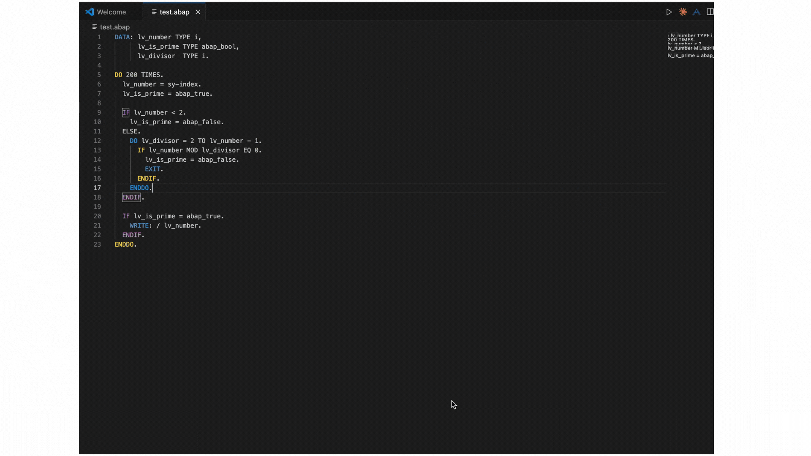

# 🚀 ABAP VSCode Assistant

**AI-powered ABAP code completion and debugging using Groq API**

A robust VS Code extension that provides intelligent ABAP code generation, debugging assistance, and syntax highlighting. Built with error-proof architecture and comprehensive user guidance.



*Watch the ABAP Code Assistant in action - generating code from comments seamlessly!*

## ✨ Features

- **🤖 AI Code Generation** - Generate ABAP code following SAP best practices
- **🐛 Debug Code Generation** - Generate debugging code with proper ABAP patterns  
- **💬 Comment-Based Generation** - Generate code from natural language comments
- **🎨 ABAP Syntax Highlighting** - Full ABAP language support with syntax highlighting
- **⚡ Groq API Integration** - Uses Groq's fast inference API for code generation
- **📚 SAP Best Practices** - Follows SAP coding standards and guidelines
- **⌨️ Keyboard Shortcuts** - Quick access with `Ctrl+Shift+G` and `Ctrl+Shift+D`
- **🔧 Error-Proof Design** - Robust extension that works even with missing dependencies
- **📊 Built-in Diagnostics** - Comprehensive troubleshooting and system diagnostics

## 🏗️ Project Structure

```
ABAP_VScode_assistant-/
├── 📚 Documentation
│   ├── README.md                           # This file
│   ├── QUICK_START.md                      # Quick start guide
│   ├── PROJECT_SETUP_COMPLETE.md           # Setup completion summary
│   └── CLEAN_PROJECT_STRUCTURE.md          # Clean project structure
│
├── 🔧 Project Setup
│   ├── requirements.txt                     # Complete Python dependencies
│   └── setup.py                            # Automated project setup script
│
├── 🚀 VS Code Extension
│   ├── extension.js                         # Main extension code (robust & error-proof)
│   ├── package.json                         # Extension manifest
│   ├── build.sh                             # Extension build script
│   ├── language-configuration.json          # ABAP language configuration
│   ├── syntaxes/abap.tmLanguage.json        # ABAP syntax highlighting
│   ├── assets/README.md                     # Extension assets documentation
│   │
│   ├── 📖 Extension Documentation
│   │   ├── README.md                        # Extension-specific documentation
│   │   ├── INSTALLATION_GUIDE.md            # Installation instructions
│   │   └── TROUBLESHOOTING.md               # Comprehensive troubleshooting guide
│   │
│   └── 🐍 Python Backend
│       ├── main.py                          # Main Python backend
│       ├── check_dependencies.py             # Dependency checker (improved)
│       ├── setup.py                          # Python backend setup
│       ├── test_backend.py                   # Backend testing script
│       └── local_ai_code_completion/        # Core AI completion package
│           ├── __init__.py                   # Package initialization
│           ├── ai_completion.py              # AI completion logic
│           ├── config.py                     # Configuration management
│           ├── logger.py                     # Logging functionality
│           └── setup.py                      # Package setup
│
└── 📝 License
    ├── LICENCE                              # Original project license (2023)
    └── extension/LICENSE                     # Extension license (2024)
```

## 🚀 Quick Start

### Prerequisites

- **Python 3.11+** (recommended)
- **Node.js 16+** (for building the extension)
- **VS Code** (latest version)
- **Groq API Key** (get one at [groq.com](https://groq.com))

### 1. Clone and Setup

```bash
# Clone the repository
git clone <your-repo-url>
cd ABAP_VScode_assistant-

# Run automated setup (recommended)
python setup.py

# Or manual setup
conda create -n abap-assistant python=3.11
conda activate abap-assistant
pip install -r requirements.txt
```

### 2. Build the Extension

```bash
# Navigate to extension directory
cd extension

# Make build script executable
chmod +x build.sh

# Build the extension
./build.sh
```

### 3. Install in VS Code

1. **Open VS Code**
2. **Go to Extensions** (`Ctrl+Shift+X` or `Cmd+Shift+X`)
3. **Click "..."** in the Extensions panel
4. **Select "Install from VSIX..."**
5. **Choose the generated `.vsix` file** from the extension directory
6. **Reload VS Code** when prompted

### 4. Setup API Key

1. **Open Command Palette** (`Ctrl+Shift+P` or `Cmd+Shift+P`)
2. **Type**: `ABAP Code Assistant: Setup Groq API`
3. **Enter your Groq API key** (starts with `gsk_`)
4. **Wait for setup completion**

### 5. Start Using

1. **Create/open an ABAP file** (`.abap`, `.sap`, `.sapabap`)
2. **Position cursor** where you want code completion
3. **Use keyboard shortcuts**:
   - `Ctrl+Shift+G` - Generate ABAP code
   - `Ctrl+Shift+D` - Generate debug code
4. **Or use commands** from Command Palette

## 🔧 Building the Extension

### Automated Build

```bash
# From project root
cd extension
./build.sh
```

### Manual Build

```bash
# Install dependencies
npm install

# Install vsce globally
npm install -g @vscode/vsce

# Package extension
vsce package
```

### Build Output

The build process creates:
- `abap-code-assistant-1.0.7.vsix` - Extension package file
- `node_modules/` - Dependencies (can be deleted after build)

## 🎯 Usage Guide

### Code Generation

#### Basic Code Generation
1. **Position cursor** in ABAP code
2. **Press `Ctrl+Shift+G`** or use command
3. **AI generates** appropriate ABAP code
4. **Code is inserted** at cursor position

#### Debug Code Generation
1. **Position cursor** in ABAP code
2. **Press `Ctrl+Shift+D`** or use command
3. **AI generates** debugging code with:
   - `BREAK-POINT` statements
   - Variable inspection code
   - Performance monitoring
   - SAP debugging patterns

#### Comment-Based Generation
1. **Write a comment** describing what you want
2. **Select the comment**
3. **Use command**: `ABAP Code Assistant: Generate Code from Comment`
4. **AI implements** the functionality described

### Available Commands

| Command | Description | Keyboard Shortcut |
|---------|-------------|-------------------|
| `ABAP Code Assistant: Generate Code` | Generate ABAP code at cursor | `Ctrl+Shift+G` |
| `ABAP Code Assistant: Generate Debug Code` | Generate debug code at cursor | `Ctrl+Shift+D` |
| `ABAP Code Assistant: Generate Code from Comment` | Generate from selected comment | `Ctrl+Shift+G` (with selection) |
| `ABAP Code Assistant: Setup Groq API` | Configure API key | - |
| `ABAP Code Assistant: Show Configuration` | Display current settings | - |
| `ABAP Code Assistant: Debug API Key` | Test API connectivity | - |
| `ABAP Code Assistant: Diagnose Extension` | Run comprehensive diagnostics | - |

### Configuration

#### VS Code Settings

```json
{
  "abapCodeAssistant.groqApiKey": "your_groq_api_key_here",
  "abapCodeAssistant.model": "qwen/qwen3-32b",
  "abapCodeAssistant.temperature": 0.3,
  "abapCodeAssistant.topP": 0.3
}
```

#### Environment Variables

```bash
# Required
GROQ_API_KEY=your_groq_api_key_here

# Optional
LACC_MODEL_NAME=qwen/qwen3-32b
LACC_TEMPERATURE=0.3
LACC_TOP_P=0.3
LACC_TIMEOUT=15000
```

## 🐍 Python Backend

### Testing the Backend

```bash
# Activate conda environment
conda activate abap-assistant

# Test backend functionality
python extension/python/test_backend.py

# Check configuration
python extension/python/main.py config

# Test code generation
export LACC_PREFIX="DATA: lv_name TYPE string."
export LACC_SUFFIX="WRITE: lv_name."
python extension/python/main.py generate
```

### Backend Commands

- `config` - Show current configuration
- `setup` - Setup with API key
- `generate` - Generate code based on context

## 🧪 Development

### Running in Development Mode

1. **Open extension folder** in VS Code:
   ```bash
   code extension/
   ```

2. **Press F5** to launch extension development host

3. **Test in new window**:
   - Open `.abap` files
   - Try commands
   - Check Developer Console for logs

### Debugging

1. **Set breakpoints** in `extension.js`
2. **Use Output panel** for logging
3. **Check Developer Console** for errors
4. **Use diagnose command** for system health

### Testing

```bash
# Test Python backend
python extension/python/test_backend.py

# Test extension commands
# Use the diagnose command in VS Code
```

## 🐛 Troubleshooting

### Common Issues

#### 1. "Could not verify dependencies" Error
**Solution**: Run `ABAP Code Assistant: Diagnose Extension` command

#### 2. Python Backend Not Working
**Solution**: 
```bash
conda activate abap-assistant
python extension/python/test_backend.py
```

#### 3. API Key Issues
**Solution**: Use `ABAP Code Assistant: Setup Groq API` command

#### 4. Extension Not Responding
**Solution**: Reload VS Code (`Ctrl+Shift+P` → "Developer: Reload Window")

### Diagnostic Commands

- **`ABAP Code Assistant: Diagnose Extension`** - Comprehensive system check
- **`ABAP Code Assistant: Show Configuration`** - View current settings
- **`ABAP Code Assistant: Debug API Key`** - Test API connectivity

### Getting Help

1. **Check Output panel**: View → Output → "ABAP Code Assistant"
2. **Run diagnose command**: `ABAP Code Assistant: Diagnose Extension`
3. **Check troubleshooting guide**: `extension/TROUBLESHOOTING.md`
4. **Review logs**: Look for error messages in Output panel

## 📚 Documentation

- **`QUICK_START.md`** - Get started in minutes
- **`extension/INSTALLATION_GUIDE.md`** - Detailed installation steps
- **`extension/TROUBLESHOOTING.md`** - Comprehensive troubleshooting
- **`PROJECT_SETUP_COMPLETE.md`** - Setup completion summary

## 🔄 Maintenance

### Regular Updates

```bash
# Update dependencies
conda activate abap-assistant
pip install -r requirements.txt --upgrade

# Rebuild extension
cd extension
./build.sh
```

### Environment Management

```bash
# List environments
conda env list

# Activate environment
conda activate abap-assistant

# Deactivate environment
conda deactivate
```

## 📄 License

This project is licensed under the MIT License. See:
- `LICENCE` - Original project license (2023)
- `extension/LICENSE` - Extension license (2024)

## 🤝 Contributing

1. **Fork the repository**
2. **Create a feature branch**
3. **Make your changes**
4. **Test thoroughly** with ABAP code
5. **Submit a pull request**

### Development Guidelines

- Follow existing code style
- Add tests for new features
- Update documentation
- Test with different ABAP versions

## 🆘 Support

### Getting Help

1. **Check troubleshooting guide** first
2. **Run diagnose command** in VS Code
3. **Review Output panel** for error details
4. **Open an issue** on the repository

### Useful Resources

- **VS Code Output panel** - Detailed error logs
- **Extension documentation** - Comprehensive guides
- **Python backend logs** - Backend error information
- **Groq API status** - [status.groq.com](https://status.groq.com)

## 🎉 Success Indicators

✅ **Extension loads without errors**  
✅ **ABAP files get syntax highlighting**  
✅ **Commands appear in Command Palette**  
✅ **Keyboard shortcuts work**  
✅ **API setup accepts your key**  
✅ **Code generation works**  

---

**Happy ABAP coding! 🚀**

*For detailed troubleshooting, see `extension/TROUBLESHOOTING.md`*
